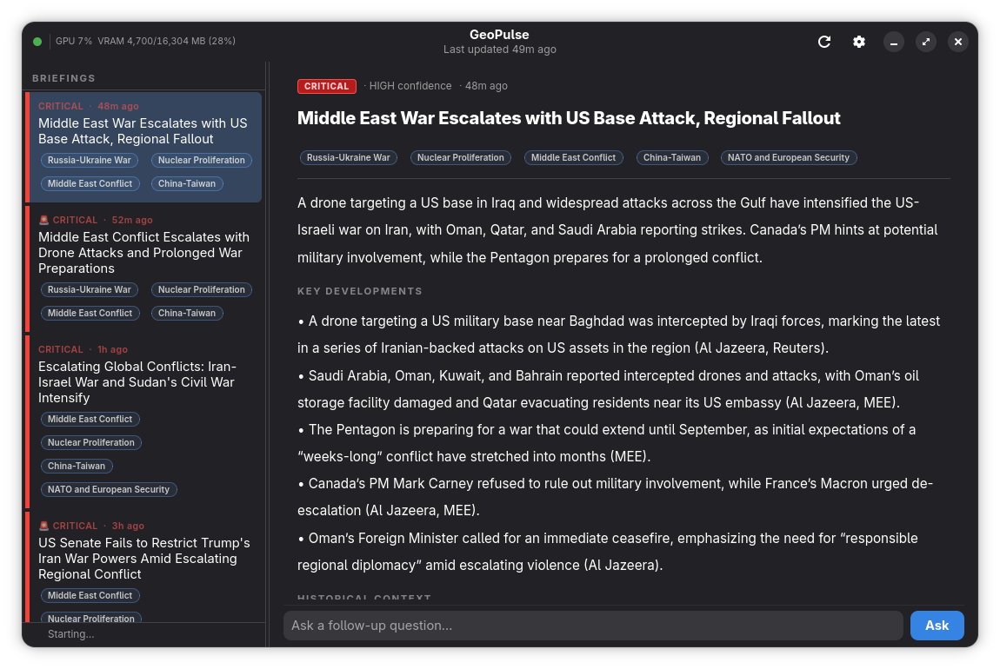
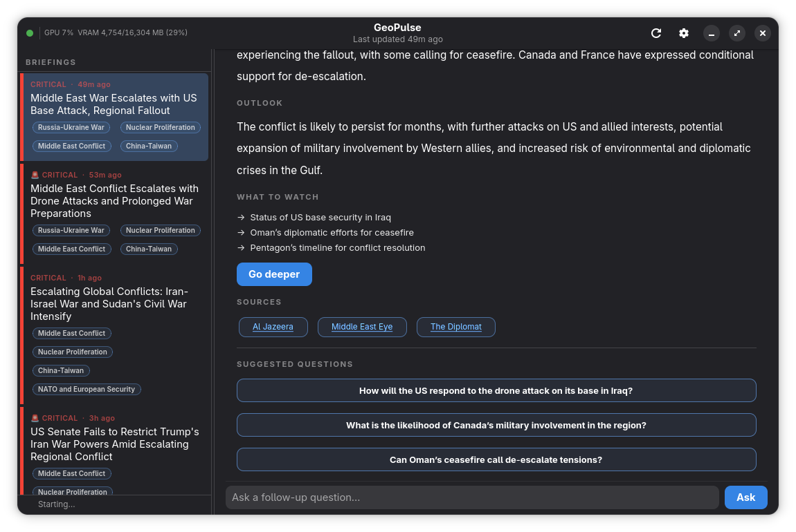

# 📡 GeoPulse

**Open source geopolitical intelligence platform. Runs fully local or via cloud API.**

*Version 0.91.0 (beta) — [GNOME-style versioning](https://handbook.gnome.org/release-planning.html): 0.x = pre-1.0 beta, 1.0 = first stable.*

---

## ⚠ Beta notice

GeoPulse is in **beta**. Expect rough edges:

- **AI prompts** have not been fully optimized; briefing quality and format may improve in future releases.
- **Data scrapers** (RSS and web fetchers) have not been fully verified across all sources; some feeds may fail or change without notice.

Feedback and contributions are welcome.

---

## What it does

A tiered background process ingests curated news sources (RSS and web). It scores severity, runs a novelty check to avoid duplicate briefings, and generates analytically structured briefings using a local LLM (Ollama) or an optional cloud API (OpenAI, Anthropic). The native GNOME desktop app shows severity-ranked briefings and inline Q&A with your model. No accounts, no telemetry—everything can run on your machine.

---

## Preview

| Briefing list & detail | Q&A chat with local LLM |
| ---------------------- | ----------------------- |
|  |        |

*Severity-ranked briefings in the sidebar; click to read the full digest. Ask follow-up questions in context with your local model (Ollama).*

---

## Features

- 🔴 **Severity-ranked briefings** — auto-classified from routine to breaking
- 📰 **Curated sources** — Reuters, BBC, Al Jazeera, AP, Foreign Policy, CFR, War on the Rocks, Bellingcat, and more (tiered: sentinel → context → official)
- 🧠 **Local or cloud LLM** — Ollama (Qwen3, Mistral, Llama, etc.) or OpenAI / Anthropic API
- 💬 **Inline Q&A** — follow-up questions against the briefing context, streamed in real time
- 🌅 **Morning briefing** — optional daily digest at a time you choose (overnight news)
- ⏱ **Scheduled briefings** — interval-based generation; both morning and scheduled can use brief or extended depth
- 📧 **Email a briefing** — send via mailto or SMTP from the context menu
- ✏️ **Editable AI prompts** — customize system and briefing prompts in Settings → Prompts
- 🔔 **Desktop notifications** — breaking alerts via libnotify; optional sound
- 🔒 **Fully private** — no accounts, no telemetry, no cloud required
- ⚙️ **Topics & sources** — add topics in Settings; sources live in `data/sources.yaml`

---

## Requirements

| Component  | Version    |
| ---------- | ---------- |
| Python     | 3.10+      |
| GTK4       | 4.0+       |
| Libadwaita | 1.0+       |
| Ollama     | Any recent (for local LLM) |
| libnotify  | Any        |

---

## Installation

### Option 1: Flatpak (recommended)

Download the `.flatpak` bundle from the [latest release](https://github.com/petterssonjonas/GeoPulse/releases) and install:

```bash
flatpak install geopulse-0.91.0.flatpak
flatpak run io.geopulse.app
```

(Ollama must be installed and running separately for local AI.)

### Option 2: .deb (Ubuntu / Debian)

Download `geopulse-0.91.0.deb` from the [releases](https://github.com/petterssonjonas/GeoPulse/releases) page, then:

```bash
sudo apt install ./geopulse-0.91.0.deb
geopulse
```

### Option 3: .rpm (Fedora / RHEL)

Download the `.rpm` from the [releases](https://github.com/petterssonjonas/GeoPulse/releases) page, then:

```bash
sudo dnf install ./geopulse-0.91.0-1.fc*.rpm
geopulse
```

### Option 4: From source

**1. System packages**

- **Ubuntu/Debian:** `sudo apt install python3-gi gir1.2-gtk-4.0 gir1.2-adw-1 libnotify-bin python3-venv`
- **Fedora:** `sudo dnf install python3-gobject gtk4 libadwaita libnotify`
- **Arch:** `sudo pacman -S python-gobject gtk4 libadwaita libnotify`

**2. Ollama** (for local LLM)

Install from [ollama.ai](https://ollama.ai) and pull a model, e.g.:

```bash
ollama pull qwen3:8b
```

**3. GeoPulse**

```bash
git clone https://github.com/petterssonjonas/GeoPulse.git
cd GeoPulse
python3 -m venv .venv
source .venv/bin/activate   # or .venv\Scripts\activate on Windows
pip install -r requirements.txt
python main.py
```

---

## Usage

- **Run the app** — `geopulse` (if installed from a package) or `python main.py` (from source). The scheduler runs while the app is open: it checks sources on an interval and generates briefings (scheduled and/or morning, if enabled in Settings).
- **Open a specific briefing** — `geopulse --briefing 5` or `python main.py --briefing 5`
- **CLI (no GUI):**
  - `python main.py --fetch` — run one ingestion cycle
  - `python main.py --generate` — generate one briefing from recent articles
  - `python main.py --list` — list recent briefings in the terminal

---

## Configuration

Config is created on first run at `~/.config/geopulse/config.yaml`. Key sections:

- **llm** — `provider` (ollama / openai / anthropic), `model`, `base_url`, `api_key`
- **schedule** — `sentinel_interval_minutes`, `briefing_interval_minutes`, throttle and retention
- **morning_briefing** — `enabled`, `time` (e.g. `"07:00"`), `depth` (brief / extended)
- **scheduled_briefing** — `enabled`, `depth`
- **notifications** — `enabled`, `min_severity`, `sound_on_briefing`
- **email** — `default_to`, `method` (mailto / smtp), SMTP settings for "Email briefing"
- **prompts** — overrides for AI prompts (see Settings → Prompts)

Sources and tiers are defined in **`data/sources.yaml`** (edit and restart). Topics are managed in the app via **Settings → Topics**.

---

## Architecture

```
┌─────────────────────────────────────────────────────────────────┐
│  GeoPulse app (single process)                                  │
│  ┌─────────────────────────────────────────────────────────────┐│
│  │  Scheduler (scraping/scheduler.py)                           ││
│  │  Sentinel → tier 2/3 on severity → novelty check → briefing ││
│  └──────────────────────────┬──────────────────────────────────┘│
│                              │                                    │
│  ┌──────────────────────────▼──────────────────────────────────┐│
│  │  SQLite (~/.local/share/geopulse/geopulse.db)                ││
│  │  articles, briefings, conversations, user_topics, state       ││
│  └──────────────────────────┬──────────────────────────────────┘│
│                              │                                    │
│  ┌──────────────────────────▼──────────────────────────────────┐│
│  │  LLM: Ollama (local) or OpenAI / Anthropic API               ││
│  │  Briefing generation, novelty check, Q&A streaming           ││
│  └──────────────────────────┬──────────────────────────────────┘│
│                              │ libnotify                          │
│  ┌──────────────────────────▼──────────────────────────────────┐│
│  │  GTK4 / Libadwaita UI (ui/)                                  ││
│  │  Sidebar (briefings) → Detail (headline, body, Q&A, email)   ││
│  └──────────────────────────────────────────────────────────────┘│
└─────────────────────────────────────────────────────────────────┘
```

---

## Roadmap

- [x] Severity-ranked briefings, tiered scraping, novelty check
- [x] Ollama + OpenAI / Anthropic API
- [x] Inline Q&A, "Go deeper," suggested questions and watch indicators
- [x] Morning briefing (time + depth), scheduled briefing toggle + depth
- [x] Email briefing (mailto / SMTP), editable AI prompts in Settings
- [x] Flatpak, .rpm, .deb, AppImage via GitHub Actions
- [ ] Ongoing AI prompt optimization and source verification
- [ ] Windows / macOS / mobile (later)

---

## License

GPL-3.0 — use, modify, and distribute under the same license. See [LICENSE](LICENSE).
