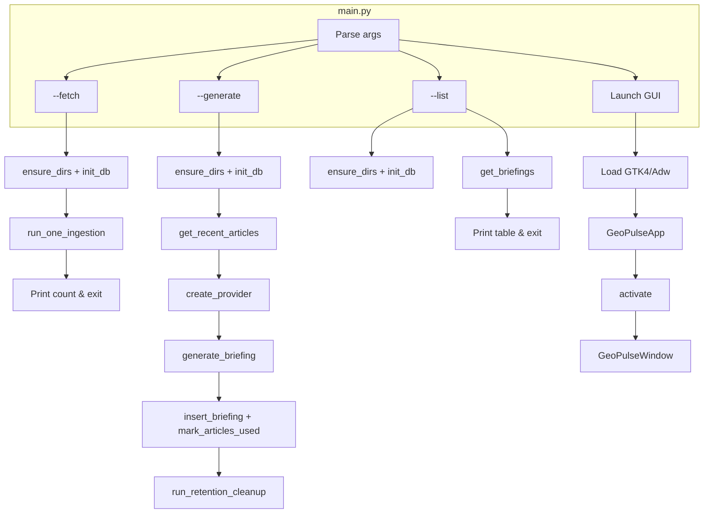
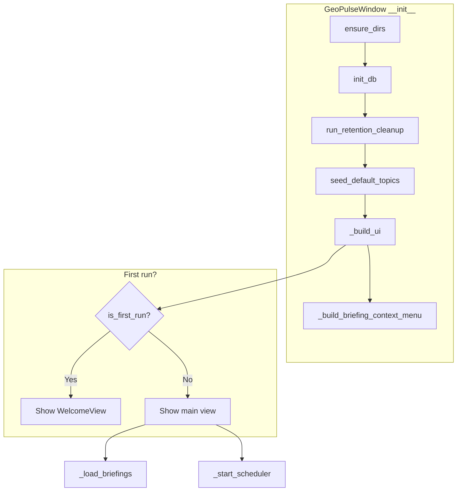
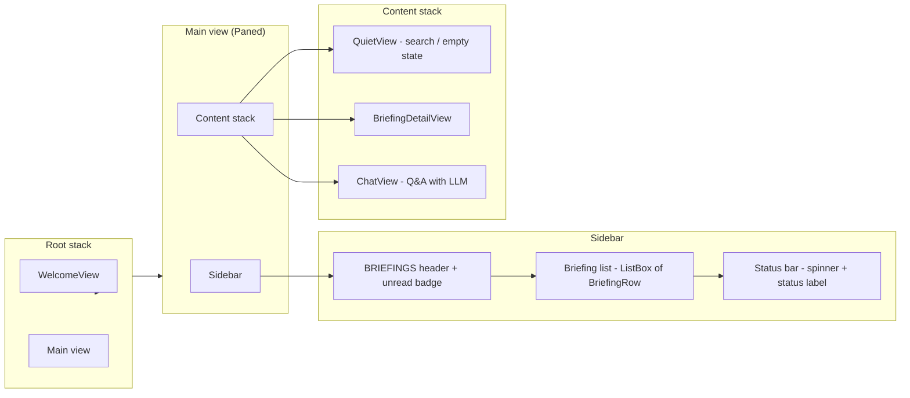
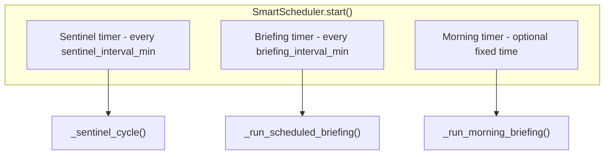
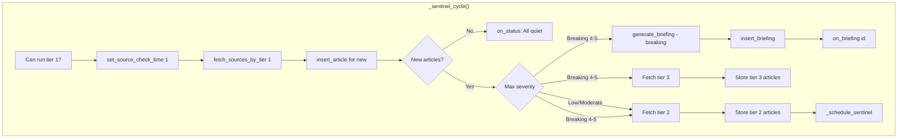
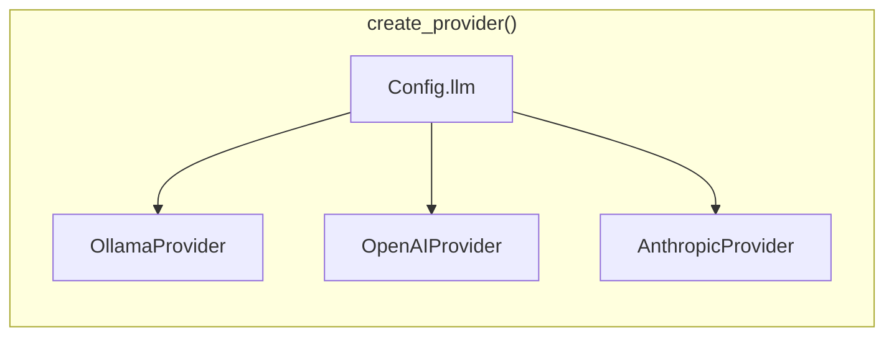
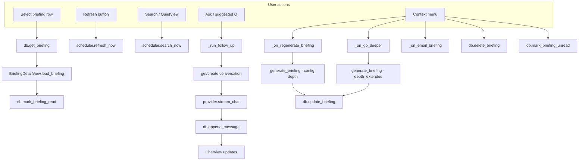
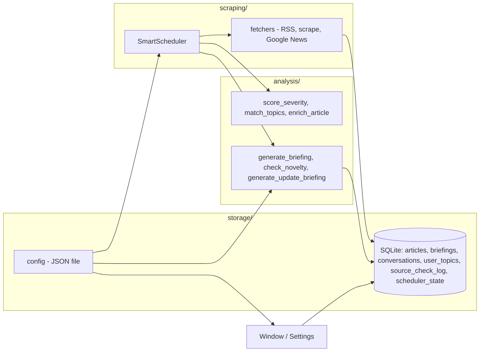

# GeoPulse – Application flow

This document describes how GeoPulse works end-to-end: entry points, GUI structure, the background scheduler, briefing generation, and data flow.

---

## Table of contents

1. [Entry points and modes](#1-entry-points-and-modes)
2. [GUI startup and main window](#2-gui-startup-and-main-window)
3. [Main UI structure](#3-main-ui-structure)
4. [Scheduler (background)](#4-scheduler-background)
5. [Briefing generation and LLM](#5-briefing-generation-and-llm)
6. [User actions](#6-user-actions)
7. [Data and config](#7-data-and-config)

---

## 1. Entry points and modes

`main.py` parses CLI arguments and either runs a one-off command or launches the GTK GUI.



- **`--fetch`**: One ingestion cycle (tiered fetch, store new articles), then exit.
- **`--generate`**: Build one briefing from recent articles via LLM, save to DB, run retention cleanup, then exit.
- **`--list`**: Print a table of recent briefings and exit.
- **No args (or `--briefing ID`)**: Start the GTK app; optionally open a specific briefing.

---

## 2. GUI startup and main window

When the GUI launches, `GeoPulseApp` handles `activate` and creates a single `GeoPulseWindow`. The window initializes the DB, runs retention cleanup, seeds default topics, and builds the UI.



- **First run**: Shows `WelcomeView` (Ollama check, model selection). On completion, switches to main view and starts the scheduler.
- **Later runs**: Show main view immediately, load briefing list, start scheduler and optional Ollama auto-start.

---

## 3. Main UI structure

The main view is a horizontal paned layout: sidebar (briefing list) + content stack.



- **Sidebar**: List of briefings (main cards and update sub-cards), severity bar, meta, headline, topic tags. Right-click context menu: Regenerate, Go deeper, Mark unread, Email, Delete.
- **QuietView**: Shown when no briefing is selected or list is empty; offers search.
- **BriefingDetailView**: Headline, summary, developments, context, actors, outlook, watch list, source chips, suggested questions, Ask bar.
- **ChatView**: Conversation for the current briefing; streamed LLM answers.

---

## 4. Scheduler (background)

`SmartScheduler` runs in the background once the main view is shown. It uses timers for sentinel checks and scheduled briefings, and optionally a morning briefing at a fixed time.



### Sentinel cycle (tiered ingestion)

Sentinel runs on an interval (e.g. every 15 minutes). It fetches **tier 1** (sentinel) sources first. Depending on severity of new articles, it may fetch **tier 2** and **tier 3** and/or generate a **breaking** briefing immediately.



### Scheduled briefing

On a timer (e.g. every 60 minutes), the scheduler fetches recent articles and runs a **novelty check** (LLM decides SKIP, NEW, or UPDATE &lt;id&gt;). It then either skips, generates a full briefing, or generates an update card linked to an existing briefing.

```mermaid
flowchart TB
    subgraph sched_brief["_run_scheduled_briefing()"]
        FetchRecent[get_recent_articles]
        FetchRecent --> Novelty[check_novelty - LLM: SKIP | NEW | UPDATE id]
        Novelty -->|SKIP| Done[on_status, schedule next]
        Novelty -->|NEW| FullBrief[generate_briefing]
        Novelty -->|UPDATE id| UpdBrief[generate_update_briefing]
        FullBrief --> InsertFull[insert_briefing]
        UpdBrief --> InsertUpd[insert_briefing - parent_briefing_id set]
        InsertFull --> MarkUsed[mark_articles_used]
        InsertUpd --> MarkUsed
        MarkUsed --> Retain[run_retention_cleanup]
        Retain --> OnBrief2[on_briefing]
        OnBrief2 --> OnRefresh[on_refresh]
    end
```

---

## 5. Briefing generation and LLM

Full briefings are produced in `analysis/briefing.py` by calling the configured LLM provider with a system prompt and a template that includes articles and depth instructions.

```mermaid
flowchart TB
    subgraph gen["generate_briefing()"]
        Depth[Resolve depth: brief | extended]
        Format[format_articles_for_prompt]
        Template[get_prompt briefing_template + depth instructions]
        SysPrompt[get_prompt system_prompt]
        Chat[provider.chat - system + user messages]
        Parse[parse_briefing_response - <<<MARKERS>>>]
        Fallback[apply_parsing_fallbacks]
        Validate[validate_briefing]
        Topics[Add article_ids, topics]
    end

    Depth --> Format
    Format --> Template
    SysPrompt --> Chat
    Template --> Chat
    Chat --> Parse --> Fallback --> Validate --> Topics
```

- **Depth**: From config (brief vs extended); controls instruction length for summary, developments, context, actors, outlook.
- **Parsing**: Model output is expected to use markers like `<<<SEVERITY>>>`, `<<<HEADLINE>>>`, etc.; `parse_briefing_response` extracts sections; fallbacks fill missing fields from articles or raw text.
- **Provider**: Chosen from config (`Config.llm()`); one of Ollama, OpenAI-compatible, or Anthropic.



---

## 6. User actions

Actions are handled in `GeoPulseWindow` and wired to the sidebar, content views, and context menu.



- **Select row**: Load briefing into detail view, mark as read.
- **Refresh**: Triggers scheduler’s immediate fetch/refresh.
- **Search**: Triggers scheduler search (e.g. Google News), then normal flow.
- **Ask / suggested Q**: Starts or continues a conversation for the current briefing; streams LLM response and appends to DB.
- **Context menu**: Regenerate (same depth), Go deeper (extended depth), Email (mailto or SMTP), Delete briefing, Mark unread.

---

## 7. Data and config

Storage and configuration are under `storage/`; scraping and analysis under `scraping/` and `analysis/`.



- **SQLite**: Articles (from feeds/scrape), briefings (with optional `parent_briefing_id` for update cards), conversations (per-briefing Q&A), user topics, source-check throttle times, scheduler state (e.g. last morning briefing date).
- **Config**: LLM provider/model, schedule intervals, retention limits, appearance, email, prompts; used by window, scheduler, and briefing generation.
